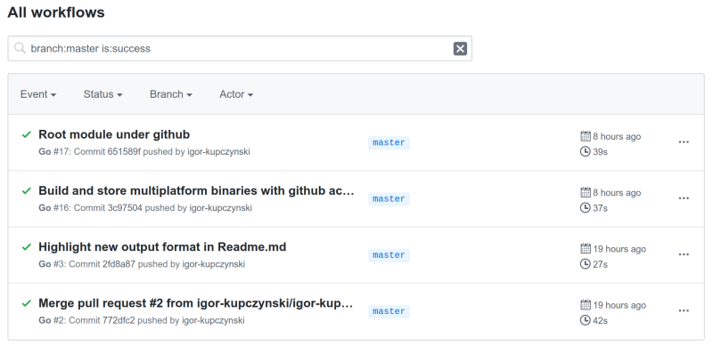
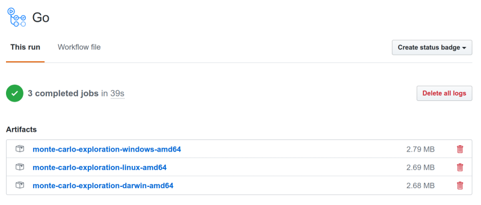

# Monte Carlo Exploration

Playground to explore Monte Carlo generators properties.

Inspired by _Fooled by Randomness_.

List of **experiments**, consult [the section below](#experiments) for a detailed overview:
* Coin toss with / without ruin.


## Get the project

If you have go already installed the easiest thing to do is to grab the package via `go get`:
```sh
go get -u github.com/igor-kupczynski/monte-carlo-exploration
```

This installs the binaries, but also puts the resources in your `$GOPATH` so you can run the included experiments, e.g.
```sh
monte-carlo-exploration --conf $GOPATH/src/github.com/igor-kupczynski/monte-carlo-exploration/examples/cointoss.toml
```

### Alternative: download binaries directly from github

Alternatively, if you don't have go or don't want to install the package you can grad the latest binaries publish by _github actions_.

1. Select the latest build [from the list](https://github.com/igor-kupczynski/monte-carlo-exploration/actions?query=branch%3Amaster+is%3Asuccess).

   _This would be **Root module under github** in the screenshot below_:
    
   

2. Download the package for your operating system -- windows, linux, or macos (this would be under _darwin_):

   

3. Extract the distribution.

   E.g. from the command line:
   ```sh
   $ unzip monte-carlo-exploration-linux-amd64.zip -d monte-carlo-exploration 
   Archive:  monte-carlo-exploration-linux-amd64.zip
     creating: monte-carlo-exploration/examples/
    inflating: monte-carlo-exploration/LICENSE  
    inflating: monte-carlo-exploration/monte-carlo-exploration  
    inflating: monte-carlo-exploration/README.md  
    inflating: monte-carlo-exploration/examples/cointoss-no-ruin.toml  
    inflating: monte-carlo-exploration/examples/cointoss.toml 
   ```
   
   You may also need to make the binary executable on linux and macos:
   ```sh
   $ chmod +x monte-carlo-exploration/monte-carlo-exploration
   ```

4. Run the experiments:

   ```sh
   $ cd monte-carlo-exploration
   $ ./monte-carlo-exploration --conf examples/cointoss.toml 
   # Run simulation examples/cointoss.toml
   ## Simulating 1000000 executions of 100 round coin toss with starting capital of $10
   
   ruined: 31.963400% (319634 / 1000000)
   Less capital: 48.864000% (488640 / 1000000)
   More capital: 44.266900% (442669 / 1000000)
   p01 $0
   p05 $0
   p10 $0
   p25 $0
   p50 $10
   p75 $16
   p90 $22
   p95 $26
   p99 $34
   ```

## Build from source


1. Checkout this repo :)

2. Get dependencies:
   ```sh 
   $ go get -v -t -d ./...
   ```

3. Build:
   ```sh
   $ go build -v .
   ```
   
4. Run tests: 
   ```sh
   $ go test -v ./...
   ```

## Experiments

### Coin toss

Simulate multiple rounds of coin tossing. Heads we get $1, tails we pay $1. We have $10 starting capital, but drawing
it down to $0 means _ruin_, and we can't continue the game.

```sh
$ ./monte-carlo-exploration --conf examples/cointoss.toml 
# Run simulation examples/cointoss.toml
## Simulating 1000000 executions of 100 round coin toss with starting capital of $10

ruined: 31.937300% (319373 / 1000000)
Less capital: 48.846400% (488464 / 1000000)
More capital: 44.283100% (442831 / 1000000)
p01 $0
p05 $0
p10 $0
p25 $0
p50 $10
p75 $16
p90 $22
p95 $26
p99 $34
```

I wound't play that -- 30%+ chance of ruin. We end up with more capital only <45% of the time, and with less >48%.

Let's ignore ruin for now. $100 and 100 rounds. We can go to ruin only in the last round.

```sh
$ ./monte-carlo-exploration --conf examples/cointoss-no-ruin.toml
# Run simulation examples/cointoss-no-ruin.toml
## Simulating 1000000 executions of 100 round coin toss with starting capital of $100

ruined: 0.000000% (0 / 1000000)
Less capital: 46.050000% (460500 / 1000000)
More capital: 46.026000% (460260 / 1000000)
p01 $76
p05 $84
p10 $88
p25 $94
p50 $100
p75 $106
p90 $112
p95 $116
p99 $124
```

Good sport, seems a fair game! Only 1% of the time we lose more than $24, and only 1% we earn more than $24.

### Pi estimation

TODO: ...

## More ideas to explore

- Stock price behavior. (what's the distribution? how to get it's params?)
- Options pricing.